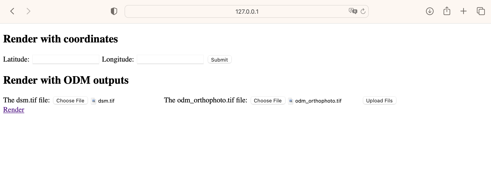
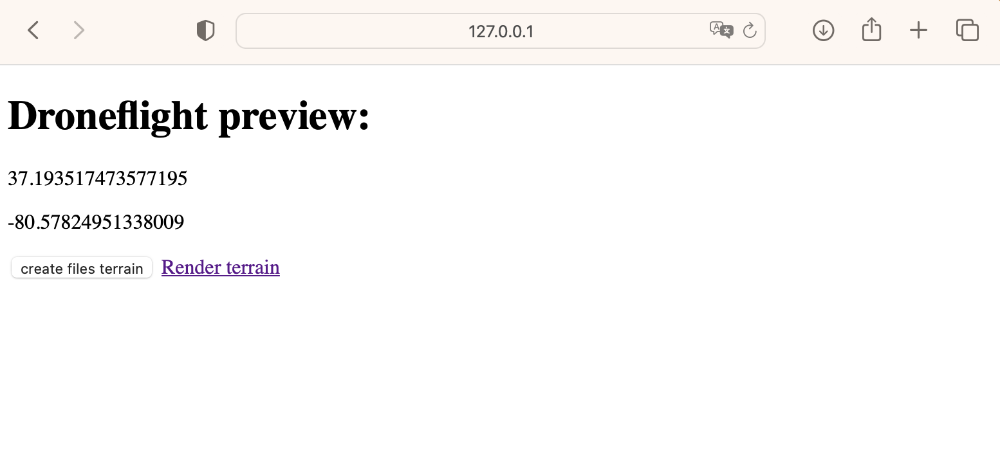
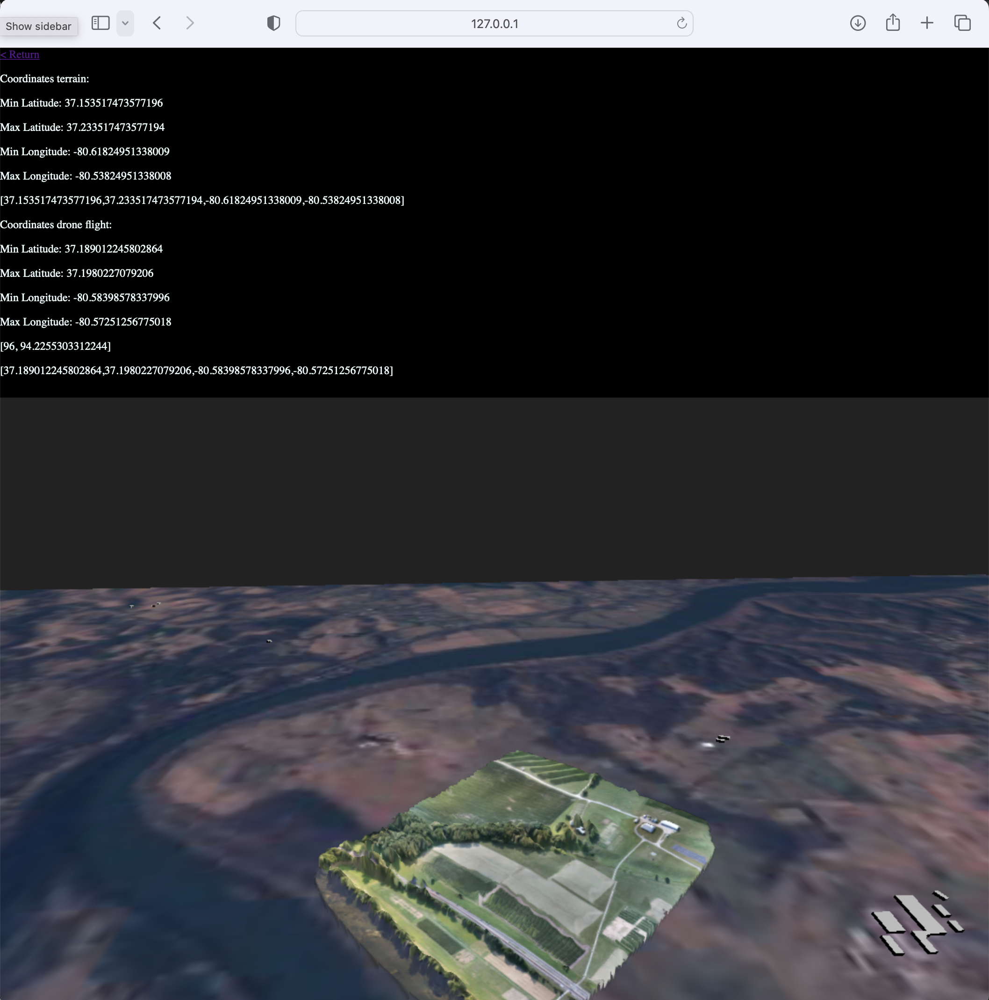

# ThreeJS GIS 
### by Development Monitors

Welcome to the ThreeJS GIS webapp, this document here will help explain the basics of this webapp, and will continously be updated to explain newer functionalities as well as any and all updates done in the future.

## What is ThreeJS?

ThreeJS is a a library for JavaScript that allows the rendering of 3D shapes in a webGL format. It is an open-source free to use library that doesn't require demanding hardware and can be easily uploaded to the cloud for hositng the 3D objects.

## What is GIS?

GIS are Geographical Information Systems, they are geographical databases that hold different type of useful data, these are administered using software tools to analyze, manage, and or manipulate the data for research purposes. 

## ThreeJS GIS

Understanding the previous principles, we can summize that ThreeJS GIS is a Geo Information System using ThreeJS to display the geographical data of specific areas. In this case, we are using DEM elevation data to dispaly 3D views of cities. Combining them with Geojson files of buidlings in said cities using Open Street Map or making our own using JOSM. These are then combined with satellite imagery to form a single unified 3D view of a city. 

## Dependencies

Before use, it is important to install the following dependencies:
- [Python](https://www.python.org/downloads/ "Install Python")
- [Pip](https://pip.pypa.io/en/stable/installation/ "Install Pip")
- [Conda](https://conda.io/projects/conda/en/latest/user-guide/install/index.html "Install Conda")
- [Elevation Py](https://pypi.org/project/elevation/ "Install Elevation Py Script") (sometimes not working with Windows OS) 
    - GNU make
    - curl
    - Gunzip (should install alongside it if installed with conda)
    - Unzip (should install alongside it if installed with conda)
    - Most of these are pre installed in many OS
- [GDAL](https://gdal.org "Install GDAL")
- [Flask](https://flask.palletsprojects.com/en/2.2.x/installation/ "Install Flask")

## Using the code/program

#### version 1.0 Dec 6, 2022

This version of the program used a combination of static data and dynamic fetching. This is called a "semi-automatic" approach to the program. There also exists a development version of a fully dynamic and automatic fetching programming for the cities. We'll explain the program really quick for each approach so far.

#### UPDATE version 1.5 Dec 21, 2022
    
- Features
    - The semi-automatic approach has been completely remade
    - Code now requires fewer user inputs in code
    - All inputs needed are done at the top, no need to hunt down code
    - Code is organized in functions
    - Program automatically sets the size and position of the terrain, as well as the size and positions of the buildings using the data from the terrain
- Notes
    - The program can now easily be converted into fully automatic, sinceit only requieres fewer inputs and the ones requried are easily obtainable.
- Patch Notes
    - Fixed misalignment issue wityh Aden
    - Fixed scaling issue caused by the previous method of placing buildings. 

### Prerequisite, using virtual environments

Before you can develop, you should have a conda enviornment that has in it all the dependencies listed above. You can create one using the command lines as follows:

> conda create --name myenv

Once created, install all dependencies in said environment. You can now run the following command

> conda activate myenv

to enter the conda environment.

### Semi-automatic (static city to city basis)

The semi-automatic approach works by rewriting the already made html files and using the terminal commands to create the terrains, place them in the correct coordinates and switch out the satellite imagery. 

1. Copy the 'template.html" file and rename it to "YOUR_CITY.html"
2. Cd into the folder "static/assets/YOUR_CITY/"
3. In the terminal, type "eio selfcheck" and make sure it says "ready". If it isn't, isntall the missing dependcies. 
4. In treminal, type "eio clip -o YOUR_CITY-DEM.tif --bounds left bottom right top", Left bottom right top reffering to the coordiantes of the area you wish to extract.
5. Use gdalinfo -mm YOUR_CITY-DEM.tif to view the geographical information. We are looking for the following:
    1. All the way at the bottom for "Computed Min/Max". (IF ERROR, THAN THE RANGE IS TOO BIG FOR THE PROGRAM. WILL BE PATCHED IN FURTURE UPDATE)
    2. Size of file "Size is xxx, yyy"
    3. Lower Left and Upper Right Coordinates
6. Execute the following command in terminal:  
    
    > gdal_translate -scale min-1 max+1 0 65535 -ot UInt16 -of ENVI YOUR_CITY-DEM.tif YOUR_CITY-DEM.bin
    - Or if you want to scale out in a new size
    
    > gdal_translate -scale min-1 max+1 0 65535 -ot UInt16 -outszie xxx yyy -of ENVI YOUR_CITY-DEM.tif YOUR_CITY-DEM.bin
    
    - Recommended to have this proportional to the real size of the image 
7. Download any exisitng city building geojson from [Open Street Map]("missingLink").
8. Download satellite images from preferred source. Current source is [Copernicus Open Access Hub](https://scihub.copernicus.eu/dhus/#/home "Satellite Images Download"). Mission 2 images at 10m res TCI are the prefered option when using this source.
    
    > Remember to download everything into the assets folder

9. Open YOUR_CITY.html again and let's begin chanigng some values.    

    1. Locate the following code around line 33 to 44.
        
        ```js
         var renderer, scene, camera, controls;
            var width  = window.innerWidth, height = window.innerHeight;
            const terrain = "../static/assets/Aden/aden.bin", geoJson = "../static/assets/Aden/export.geojson";
            const segmentX = 377, segmentY = 277
            const upperRight = [45.0670829, 12.8984722]; lowerLeft = [44.8576389, 12.7445837];
            const center = [median([upperRight[0], lowerLeft[0]]), median([upperRight[1], lowerLeft[1]])];
            var sizeX = calculateSize()[0], sizeY = calculateSize()[1];
            const satImage = "../static/assets/Aden/adenView.jp2";
            var vertexArray = new Array(), buildingArray = new Array();
            var xarray = new Array(), yarray = new Array();
            var centerTerrainX, centerTerrainY;
            var count = 0; var counter = 0;
        ```

        - Replace the "const terrain" location with YOUR_CITY.bin files location
        - Replace the "geoJson" address wtih YOUR_CITY.geojson file location.
        - Replace the value of segmentX and segmentY with the values of Size from the tif file (Check step 5.2)
        
    2. Locate the following code around line 101 to 102.

        ```js   
           var material = new THREE.MeshPhongMaterial({
                        color: 0x000000, 
                        wireframe: true
                    });

            var texture = new THREE.TextureLoader().load(satImage);

            var material = new THREE.MeshBasicMaterial({
               map: texture
            });
        ```
        - If planning to use image, uncomment var material undwer the texture loader and comment the wireframe material. Else, leave as is
        
With all this done, you should have a city made in no time. It takes around 4 to 5 minutes of actual writing, the long process is simply looking for coordinates, downloading the files like geojson and the satellite imagery. These downloads can extend the time of operation from 5 minutes to around 20 minutes or even an hour. It depends on your internet speed and the size of the files. 

### Automatic fetching (EXPERIMENTAL)

This method is yet to work fully. So far it only downlaods the tif file automatically. To access it: 
 
1. Select the button "(Experimental) Dynamic Fetching" in the index page.
2. In this site, type the coordiantes of being asked. This will download a tif file in the asset folder. You should know however that this is all it does. 

It currently displays a manually made terrain following the semi automatic instructions. The only step it skips so far is the tif file download. There is a chance in the future to be able to convert it to binary and to also fetch the terrain based on the coordiantes placed. OSMBuidlings seems to have an API that could allow for dynamically fetching buildings in the area. 

### Displaying the semi-automatic cities

To add the new city to the webapp, you must create a way to navigate to it in the flask environment. This is fairly simple.

1. Open app.py
2. Check the following code.

```py
    @app.route('/Taiz')
    def taiz():
        return render_template('taiz.html')

    @app.route('/Aden')
    def aden():
        return render_template('aden.html')

    @app.route('/experimentalPlayground')
    def dRender():
        return render_template('dynamicRender.html')
```

2. Create a own directory following the same format.

```py
    @app.route('/YOUR_CITY')
    def YOUR_CITY():
        return render_template('YOUR_CITY.html')
```

3. Open index.html
4. Check the following lines:
 
```html 
    <!-- User Inputs-->
    <a href="{{url_for('taiz') }}">Taiz</a>
    <a href="{{url_for('aden') }}">Aden</a>
    <a href="{{url_for('dynamic') }}">(Experimental) Dynamic Fetching</a>
```

5. You will add a line that gives acess to your city using the same format.

```html
    <a href="{{url_for('YOUR_CITY') }}">YOUR_CITY</a>
```

And done. Now when running the program, you will see it in the index page, and you may access it for viewing and testing, as well as developing.

### Running the web server with Flask

Flask is a webapp hosting tool used for real servers or for development servers. This is what gives the webapp the ability to navigate using special security, credentials, allow material to be transfered from one file to another in future versions, and it allows the use of special addresses. To run the website, you must use flask. This is how you start it up.

1. In your terminal, type the following commands
    
    > export FLASK_ENV=development
    
    > flask run

2. Wait for server to load and open the webapp using the link given on startup. 

### For mac
1. Make sure to have a 'download' folder in the rootfolder.
2. Use the app.py file from the KaatBranch

All the commands that are excecuted with the subproces module need to be in an array.  
So instead of:
```py
   translate_cmd = 'gdal_translate -scale {} {} 0 65535 -ot UInt16 -of ENVI elevation.tif static/output.bin'.format(int(min-1),int(max+1))
    subprocess.run(translate_cmd)
```
You get:
```py
 subprocess.run(['gdal_translate', '-scale', str(newMin), str(newMax), '0', '65535', '-ot', 'UInt16','-of', 'ENVI', 'elevation.tif', 'static/output.bin'])
```


### Running the webserver with Docker
1. Install [Docker](https://docs.docker.com/get-docker/) on your computer
2. Pull the code or just add the Dockerfile, docker-compose.yml and environment.yml files to your folder (from the KaatBranch). 
    (If you want to add more packages, add these to the environment.yml file.) 
3. Make sure docker is running
4. Open the folder in the terminal and type the following command
    > docker compose up

Docker will now build and run your application. The first time this process will take a while.

### Display Drone layer
To display the outputs of OpenDroneMaps (ODM) on the terrain, you need to follow the next steps:
1. Go to the DYNAMIC RENDERING page and upload the dsm.tif and odm_orthophoto.tif file (generated with ODM)  
    
2. Press 'Upload File' and wait
3. You will get redirected to a page where you can see the center coordinates of the drone flight  
    
4. Press 'create files terrain' and wait untill all the files are created
5. Press 'Render terrain' and you should see the terrain with the drone layer on top of it
    

## Screenshots

Here are some screenshots of the city of Aden to help illustrate the potential of the program. 


Image of Aden from an angle


Image of Aden from the floor


## Acknowledgements

Special thanks to Joel Rhine for supervising this project, and James Week for leading the team.

Buidling fetching code tool written by Santiago Gabian
Terrain fetching tool adapted by Esteban Sanchez, using works from [Bjron Sandvik's Terrain tool](https://github.com/turban/webgl-terrain/tree/master "WebGL Terrain using ThreeJS")
